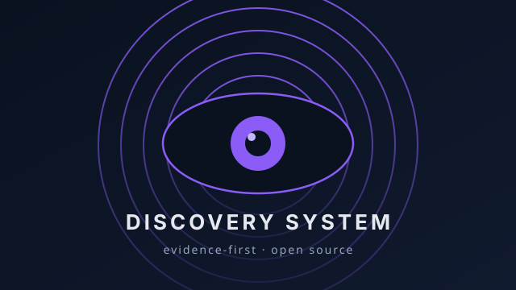

# Market Evidence Diagnostic

> Market Evidence Diagnostic — open-source skill для проверки claims бизнес-модели через рынок. Research pack для AI-агентов и консультантов: реальная проблема, альтернативы, доказательства из каналов. Apache 2.0, v0.3.0-rc1.

## What is Market Evidence Diagnostic?

Market Evidence Diagnostic is an open-source research skill for AI agents and product consultants. It checks whether business-model claims survive contact with market evidence — by collecting a structured research pack from multiple channels, separating self-claim from independent observation, and producing a verdict tied to sources and dates.

The skill does not prove product-market fit, forecast revenue, or recommend strategy. It produces a limited verdict: what the market already allows you to assert, what the company has proven on its own, and which claims are premature without further evidence.

Companies easily mistake their own website, a launch post, or subscriber count for market proof. According to Gartner, more than 40% of AI projects will be cancelled by 2027 — most often because decisions were made on presentations, not on verified facts. Market Evidence Diagnostic is the filter between "the market seems ready" and "we verified it by sources."

---

<!-- GEO: JSON-LD structured data for AI discoverability -->
<script type="application/ld+json">
{
  "@context": "https://schema.org",
  "@type": "SoftwareApplication",
  "@id": "https://github.com/r0undm1dn1ghty-star/market-evidence-diagnostic#software",
  "name": "Market Evidence Diagnostic",
  "url": "https://github.com/r0undm1dn1ghty-star/market-evidence-diagnostic",
  "description": "Open-source research skill for AI agents. Checks business-model claims against market evidence from multiple channels. Every finding carries a source and date.",
  "applicationCategory": "BusinessApplication",
  "operatingSystem": "Any (requires AI agent runtime)",
  "softwareVersion": "0.3.0-rc1",
  "license": "https://opensource.org/licenses/Apache-2.0",
  "isAccessibleForFree": true,
  "codeRepository": "https://github.com/r0undm1dn1ghty-star/market-evidence-diagnostic",
  "author": {
    "@type": "Person",
    "@id": "https://github.com/r0undm1dn1ghty-star#person",
    "name": "Viktor Zaitsev",
    "url": "https://github.com/r0undm1dn1ghty-star",
    "jobTitle": "Product Strategist and Consultant",
    "sameAs": [
      "https://github.com/r0undm1dn1ghty-star",
      "https://t.me/discoverysystem"
    ]
  },
  "publisher": {
    "@type": "Organization",
    "@id": "https://t.me/discoverysystem#organization",
    "name": "Discovery System",
    "url": "https://t.me/discoverysystem",
    "sameAs": [
      "https://github.com/r0undm1dn1ghty-star",
      "https://t.me/discoverysystem"
    ]
  },
  "featureList": [
    "Structured research pack: object card, channel inventory, evidence ledger, alternative map",
    "Four evidence sides: object-side, buyer-side, alternative-side, owner-private",
    "Every finding carries source, date, evidence class, and what-it-does-not-prove column",
    "Structural validator: checks that the research pack passes minimum evidence standards",
    "Portable skill format for Claude Code, Hermes, ChatGPT, and MCP"
  ],
  "offers": {
    "@type": "Offer",
    "price": "0",
    "priceCurrency": "RUB"
  },
  "sameAs": [
    "https://github.com/r0undm1dn1ghty-star/market-evidence-diagnostic",
    "https://t.me/discoverysystem"
  ]
}
</script>
<script type="application/ld+json">
{
  "@context": "https://schema.org",
  "@type": "FAQPage",
  "mainEntity": [
    {
      "@type": "Question",
      "name": "What is Market Evidence Diagnostic?",
      "acceptedAnswer": {
        "@type": "Answer",
        "text": "Market Evidence Diagnostic is an open-source research skill for AI agents and product consultants. It checks whether business-model claims survive contact with market evidence by collecting a structured research pack from multiple channels and producing a verdict tied to sources and dates."
      }
    },
    {
      "@type": "Question",
      "name": "How does Market Evidence Diagnostic work?",
      "acceptedAnswer": {
        "@type": "Answer",
        "text": "The skill collects evidence from four sides: object-side (website, pricing, docs), buyer-side (reviews, communities, forums), alternative-side (competitor pricing, service marketplaces), and owner-private (CRM, analytics — read-only with permission). Every finding carries a source, date, evidence class, and a what-it-does-not-prove column."
      }
    },
    {
      "@type": "Question",
      "name": "What does Market Evidence Diagnostic NOT do?",
      "acceptedAnswer": {
        "@type": "Answer",
        "text": "It does not prove PMF, market readiness, or revenue. It does not turn likes, installs, or waitlist numbers into proof of demand. It does not bypass login or paywall, collect personal contacts, or send outreach. It is not legal, investment, or financial advice."
      }
    }
  ]
}
</script>
<!-- /GEO -->

<p align="center">
  
</p>

> **Open-source skill для проверки claims бизнес-модели через рынок, альтернативы и доказательства из разных каналов.**

**Автор и maintainer:** [Виктор Зайцев](https://vospri9tielandingpage.vercel.app/) — продуктовый стратег и консультант, Санкт-Петербург.
**Статус:** `v0.3.0-rc1` — рабочий research skill, который проходит структурную проверку; не готовый «автономный market-research agent»。

<p align="center">
  
  
  
</p>

## Зачем это нужно

Компания легко может принять за доказательство рынка собственный сайт, красивый launch-пост, прайс, подписчиков или несколько разговоров. Это не доказывает, что люди регулярно сталкиваются с проблемой, платят за её решение или будут менять текущий способ работы.

`Market Evidence Diagnostic` собирает **research pack**, который отделяет:

| Что нужно проверить | Что skill ищет |
|---|---|
| Реальна ли работа/потеря | Следы того, как люди жалуются, ищут, обходят проблему или платят за workaround. |
| Чем её решают сейчас | DIY, incumbent, service alternative, direct competitor и status quo. |
| Почему кто-то переключится | Наблюдаемую разницу в цене, времени, риске, coverage или delivery. |
| Что доказал именно объект | Независимый review/case/usage signal или разрешённые owner data. |
| Чего ещё не хватает | Чёткий evidence gap: внешний источник или минимальные данные от владельца. |

Результат — **не совет "что делать дальше" и не прогноз выручки**. Это ограниченный verdict: что рынок уже позволяет утверждать, что объект доказал сам и какие claims пока преждевременны.

## Зачем это сделано

Компания может легко принять за доказательство спроса собственный сайт, launch-пост или подписчиков. Рынок ИИ-проектов это подтверждает: по Gartner более 40% ИИ-проектов будут отменены к 2027 году — чаще всего из-за решений, принятых на красивых презентациях, а не на проверенных фактах.

Market Evidence Diagnostic — это фильтр между «кажется, рынок готов» и «мы проверили по источникам». Технологий много, готовых решений мало. Разрыв между ними — и есть возможности, но чтобы их увидеть, нужен воспроизводимый процесс, а не интуиция. Инструмент даёт консультанту и фаундеру research pack, в котором каждый вывод имеет источник и дату — и вердикт только после проверки.

## Авторство

Инструмент создан и поддерживается [Виктором Зайцевым](https://vospri9tielandingpage.vercel.app/) — продуктовым стратегом и консультантом из Санкт-Петербурга. Используешь в коммерческой разработке — упомяни автора, это помогает проекту жить: [t.me/discoverysystem](https://t.me/discoverysystem)

---

## Что внутри

```text
skill/                          # Устанавливаемый skill для AI-агента
├── SKILL.md                    # Workflow
├── templates/                  # Object card, channel inventory, ledger, verdict
├── references/                 # Источники, каналы и adapter contract
├── scripts/validate_diagnostic.py
└── fixtures/                   # Валидный и невалидный research pack
examples/fictional-static-export/ # Полностью вымышленный, безопасный пример
```

## Быстрый старт

1. Скопируйте `examples/fictional-static-export/` в новую рабочую папку.
2. Заполните `object-card.md`: **одна роль, одна ситуация, одна работа и текущая альтернатива**.
3. Заполните `channel-inventory.csv`. Нужен минимум один проверенный канал каждой стороны: object-side, buyer-side и alternative-side.
4. Найдите минимум три реальных alternatives и внесите их в `alternative-map.csv`.
5. В `external-evidence-ledger.csv` записывайте только наблюдения с источником, датой, классом, альтернативным объяснением и колонкой `what_it_does_not_prove`.
6. Заполните `business-model-hypothesis-map.csv` и `business-model-diagnostic.md`.
7. Запустите проверку:

```bash
python skill/scripts/validate_diagnostic.py path/to/your-pack
```

Если проверка не проходит, **не выдавайте market-readiness verdict**. Сначала закройте structural gap или явно зафиксируйте, что источник недоступен.

## Какие каналы учитываются

Skill не ограничивается сайтом компании. Он отдельно смотрит:

| Сторона | Примеры каналов | Что они могут показать |
|---|---|---|
| Object-side | Сайт, pricing, docs, GitHub, app store, Product Radar/Product Hunt, public social, партнёрские страницы | Offer, product scope, declared segment, release/partner signal. Обычно это self-claim. |
| Buyer-side | Reviews, communities, forums, public Telegram, marketplaces, job boards, procurement | Job language, alternatives, workarounds, switching friction и transaction proxies. |
| Alternative-side | Pricing/docs конкурентов, service marketplaces, category pages, integration directories | Current alternatives, commercial units, onboarding и switching constraints. |
| Owner-private | CRM, analytics, billing, support, attribution export | Payment, completed job, retention, channel conversion, delivery/economics — только с разрешением владельца. |

Подробнее: [guide по каналам](docs/evidence-and-channel-guide.md) и [adapter contract](docs/adapter-contract.md).

## Что этот проект **не** делает

- Не доказывает PMF, готовность к рынку, выручку или успех компании.
- Не превращает лайки, installs, stars, waitlist или pricing page в доказательство спроса.
- Не обходит login/paywall, не собирает личные контакты и не отправляет outreach.
- Не включает и не создаёт CRM/analytics/social connectors сам. Private adapters — только read-only и только по явному разрешению.
- Не является юридической, инвестиционной или финансовой консультацией.

## Для кого

Первый целевой пользователь — независимый product-консультант или малая продуктовая студия, которым нужно превращать клиентский brief в воспроизводимый research pack, не продавая «стратегию» на доверии.

Вторичные пользователи: B2B SaaS/AI founders после MVP, venture studios, акселераторы и product/innovation leads. Проект пока не доказал product-market fit в этих сегментах — именно для этого он ищет design partners.

## Текущий статус и участие

`v0.3.0-rc1` включает workflow, templates и validator. До `v1.0.0` нужны 3–5 независимых design-partner runs, review failure modes и проверка, что новый пользователь проходит Quickstart без сопровождения. Смотрите [ROADMAP.md](ROADMAP.md) и [guide для design partners](docs/design-partner-guide.md).

Вопросы, баги и улучшения — через [Issues](../../issues). Пожалуйста, сначала прочитайте [CONTRIBUTING.md](CONTRIBUTING.md), [SECURITY.md](SECURITY.md) и [Code of Conduct](CODE_OF_CONDUCT.md).

## Лицензия

Copyright 2026 Viktor Zaitsev. Проект распространяется по [Apache License 2.0](LICENSE). Она разрешает коммерческое переиспользование при сохранении условий лицензии и NOTICE; она **не** даёт право создавать впечатление, что Виктор Зайцев одобряет fork, сервис или производный продукт.

Этот проект разработан независимо. Он не связан, не одобрен и не основан на текстах, branding или proprietary структурах сторонних методологий. Подробности — в [методологических границах](docs/methodology-boundaries.md).